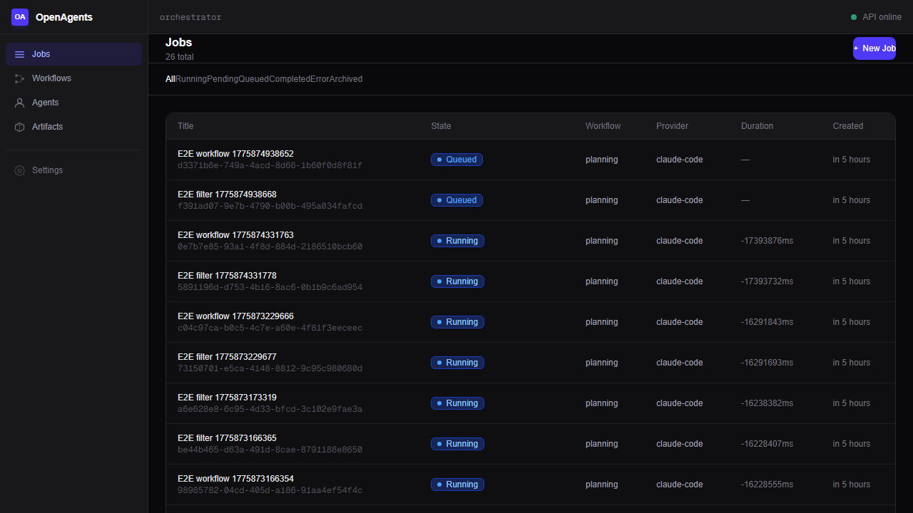
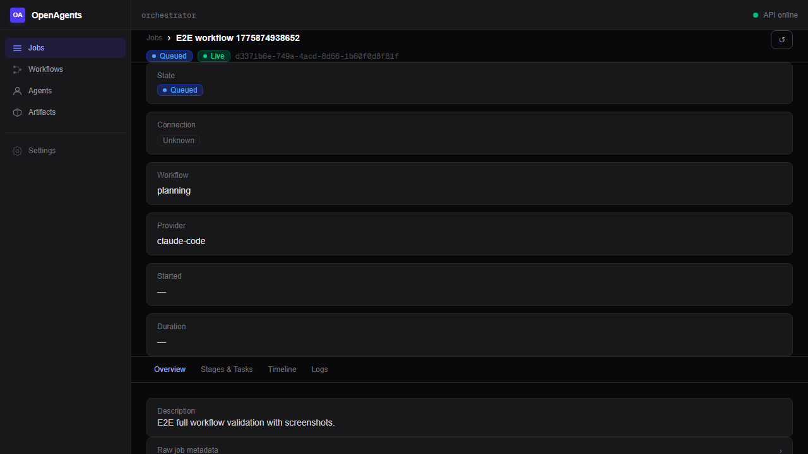
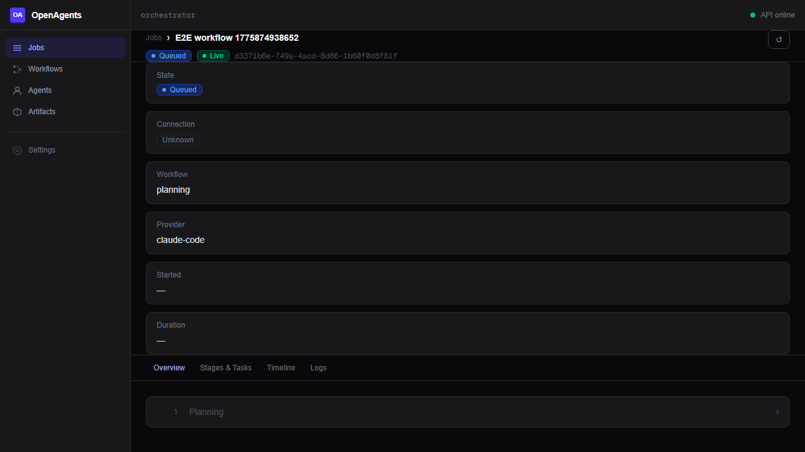
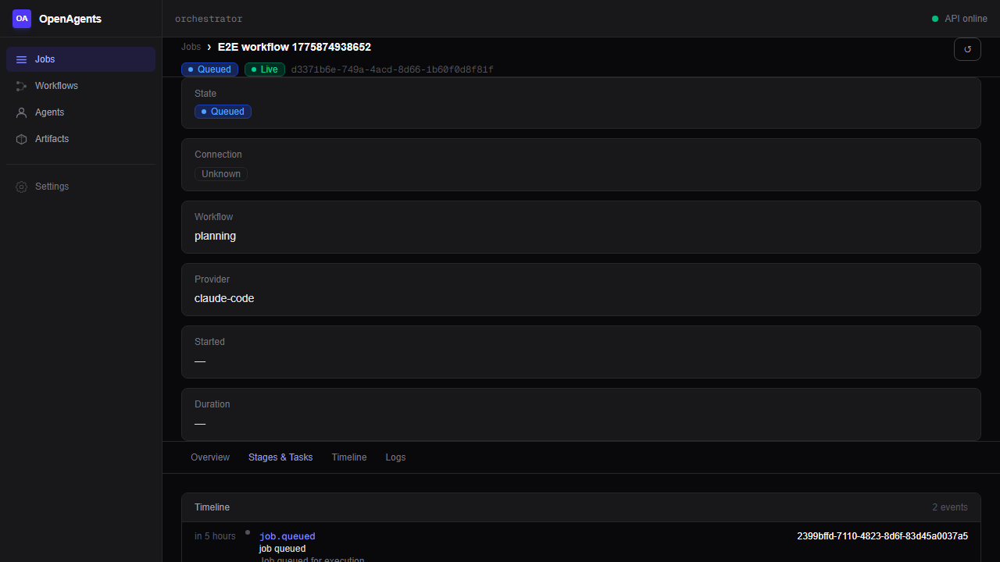
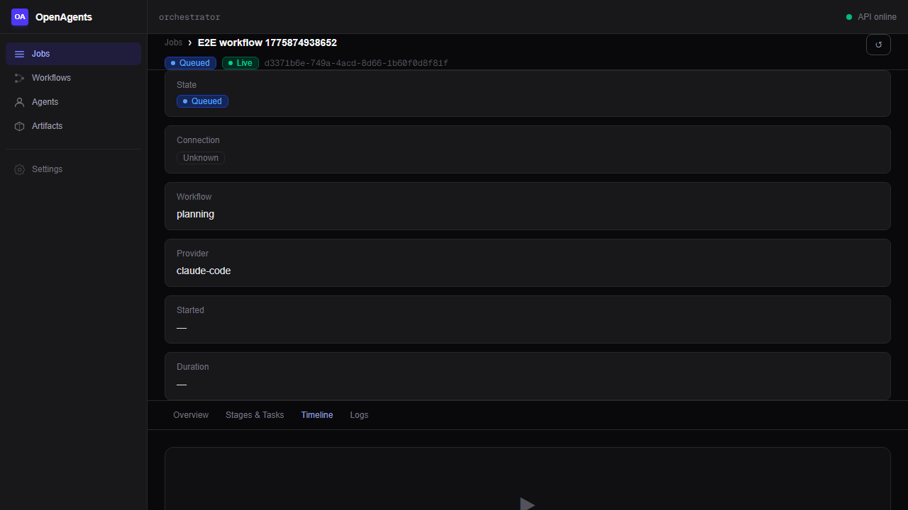
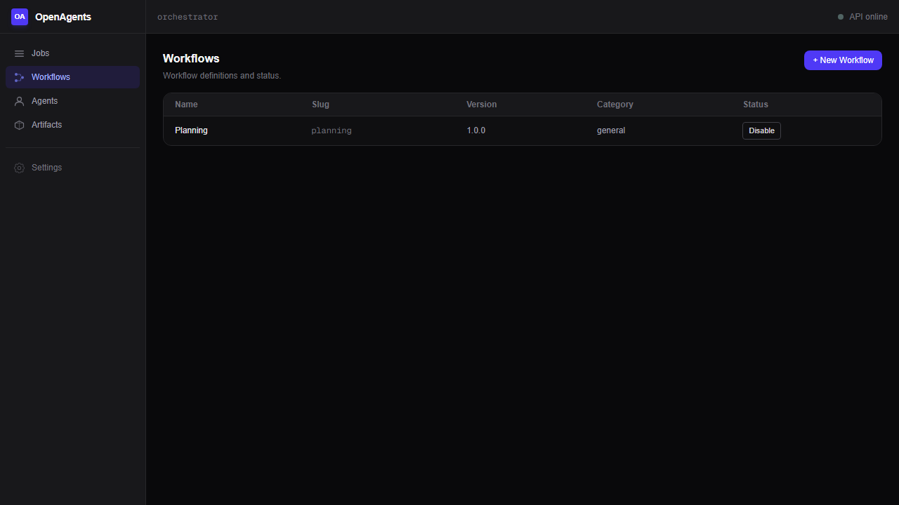
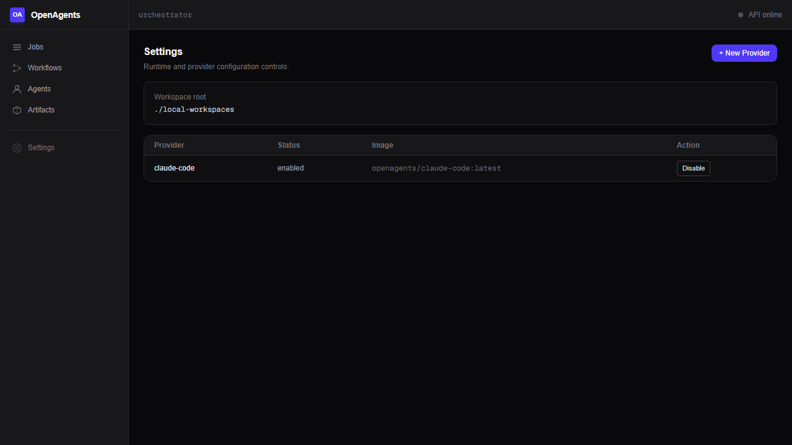
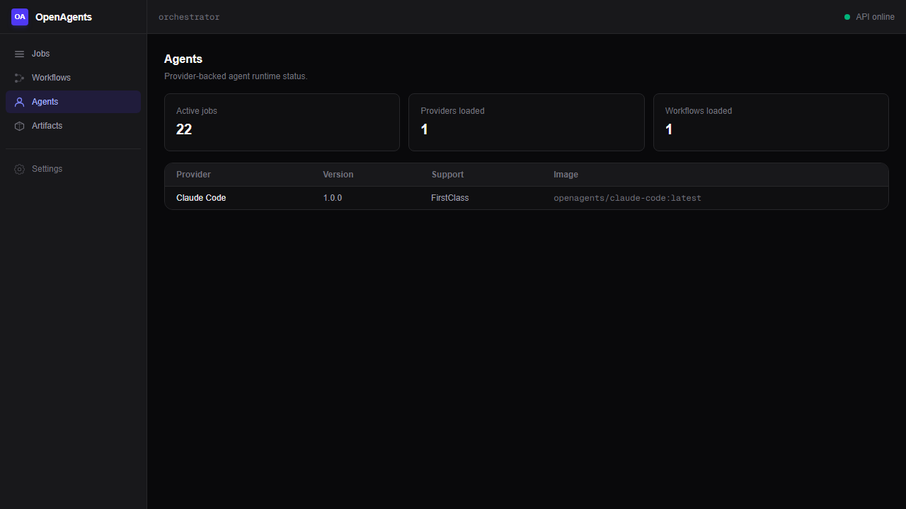
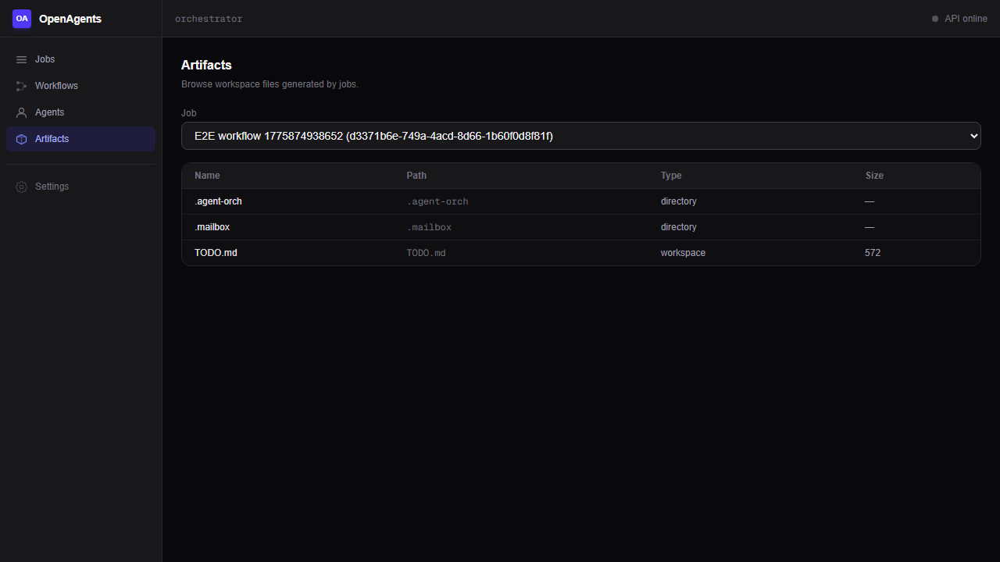

# OpenAgents UI Quickstart

This guide walks you through running OpenAgents and launching your first agent job from the web UI.

## 1) Start the stack

```bash
docker compose up -d --build
```

Open:

- Web UI: `http://localhost:3001`
- API health: `http://localhost:8080/healthz`

## 2) Open Jobs and create a run

1. Go to **Jobs**.
2. Click **New Job**.
3. Fill:
   - **Title**: a short run name
   - **Prompt / Request**: what the agent should do
   - **Workflow**: usually `planning`
   - **Provider**: usually `claude-code`
   - **Workspace path**: local path for artifacts
4. Click **Create Job**.



## 3) Monitor execution

Open job detail and use tabs:

- **Stages & Tasks** for execution breakdown
- **Timeline** for events
- **Logs** for process output






## 4) Configure workflows and providers

- **Workflows** page lets you create and enable/disable workflow definitions.
- **Settings** page lets you create and enable/disable provider definitions.




## 5) Inspect runtime and artifacts

- **Agents** shows runtime/provider summary.
- **Artifacts** browses workspace outputs for a selected job.




## 6) Validate end-to-end locally

```bash
pnpm format:check
dotnet test apps/orchestrator-api/OpenAgents.OrchestratorApi.csproj -v minimal
pnpm --filter orchestrator-web type-check
pnpm --filter orchestrator-web build
pnpm --filter orchestrator-web e2e
pnpm validate:compose
```
